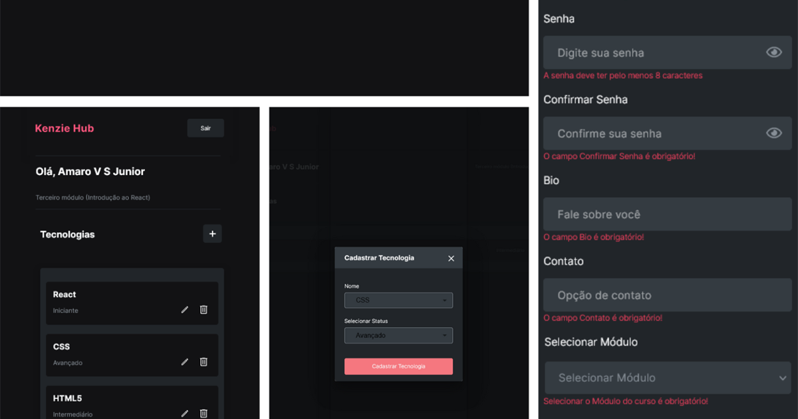
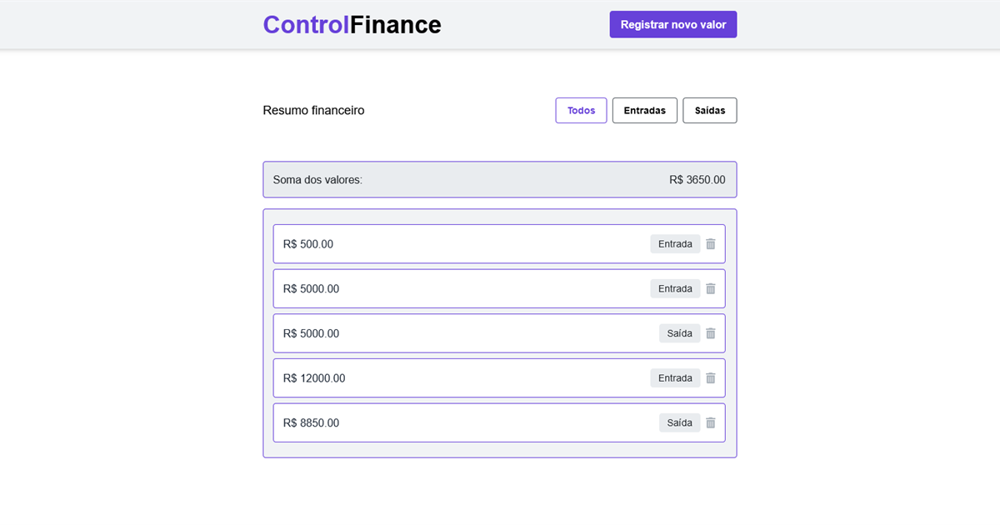
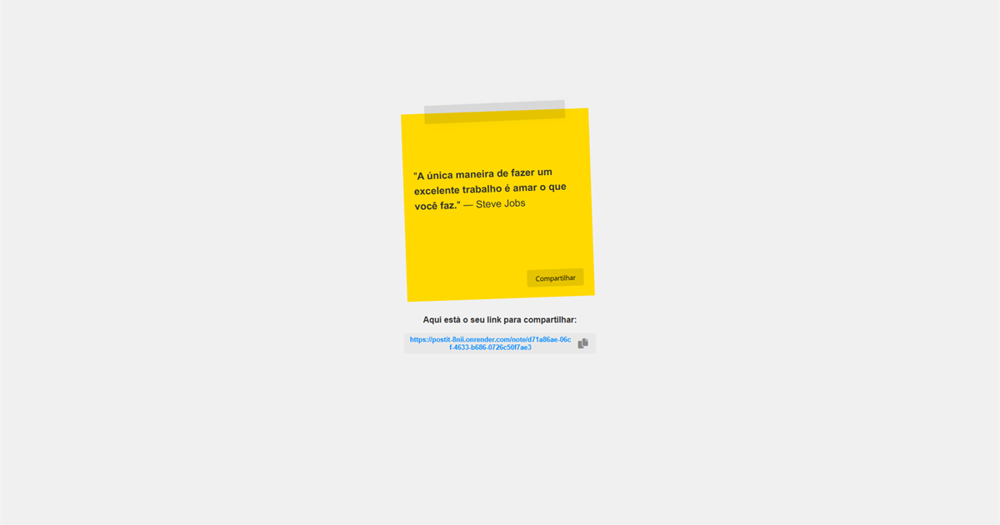
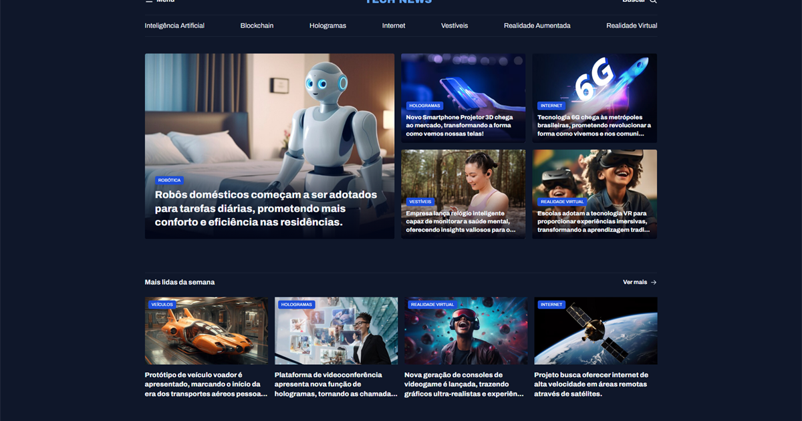

[](https://git.io/typing-svg)


```js
const aboutMe = {
  name: "Amaro Júnior",
  location: "Atibaia, São Paulo, Brazil",
  interests: ["web development", "AI", "books", "movies", "running", "philosophy"],
  hardSkills: ["JavaScript", "React.js", "Next.js", "Node.js", "Express.js", "Tailwind CSS", "TypeScript"],
};

const contactMe = {
  linkedin: "https://www.linkedin.com/in/jrvalerio/",
  email: "amarovsjr81@gmail.com",
  github: "https://github.com/jrvalerio",
  x: "https://www.twitter.com/avsjr81",
  youtube: "https://www.youtube.com/@avsjr",
};
```

---

## 🔗 Connect with me

<div align="left">
  <a href="https://www.linkedin.com/in/jrvalerio" target="_blank"></a>
  <a href="mailto:amarovsjr81@gmail.com" target="_blank"></a>
  <a href="https://github.com/jrvalerio" target="_blank"></a>
  <a href="https://instagram.com/jrvalerioo" target="_blank"></a>
  <a href="https://www.twitter.com/avsjr81" target="_blank"></a>
  <a href="https://www.youtube.com/@avsjr" target="_blank"></a>
</div>

---

## 🧰 Languages and Tools (core)

<div align="left">
  
  
  
  
  
  
  
  
  
  
</div>

---

## 🚀 Main Projects (top picks)

<table>
  <tr>
    <td width="50%" valign="top">
      <h3>✅ Kenzie Hub</h3>
      <a href="https://kenzie-hub-seven-blue.vercel.app/">
        
      </a>
      <p><strong>Descrição:</strong> Plataforma para cadastro e gestão de tecnologias estudadas, com foco em formulários, validação e fluxo autenticado.</p>
      <p><strong>Stack:</strong> React, React Router Dom, Axios, React Hook Form, Zod, SASS</p>
      <p>🔗 <a href="https://github.com/JrValerio/Kenzie-Hub">Repo</a> | 🌐 <a href="https://kenzie-hub-seven-blue.vercel.app/">Demo</a></p>
    </td>
    <td width="50%" valign="top">
      <h3>✅ Control Finance</h3>
      <a href="https://control-finance-react-tail-wind.vercel.app/">
        
      </a>
      <p><strong>Descrição:</strong> Aplicação de finanças pessoais para lançar entradas e saídas, acompanhar saldo e filtrar transações por categoria.</p>
      <p><strong>Stack:</strong> React, Tailwind CSS, JavaScript</p>
      <p>🔗 <a href="https://github.com/JrValerio/Control-Finance-React-TailWind">Repo</a> | 🌐 <a href="https://control-finance-react-tail-wind.vercel.app/">Demo</a></p>
    </td>
  </tr>
  <tr>
    <td width="50%" valign="top">
      <h3>✅ Post-it Share App 📝</h3>
      <a href="https://postit-8nii.onrender.com/">
        
      </a>
      <p><strong>Descrição:</strong> App minimalista para criar notas curtas, gerar links compartilháveis e publicar recados de forma simples e rápida.</p>
      <p><strong>Stack:</strong> Node.js, Express, SQLite, HTMX, ESLint, Prettier</p>
      <p>🔗 <a href="https://github.com/JrValerio/postit">Repo</a> | 🌐 <a href="https://postit-8nii.onrender.com/">Demo</a></p>
    </td>
    <td width="50%" valign="top">
      <h3>✅ News Portal</h3>
      <a href="https://jrvalerio.github.io/newsportal/">
        
      </a>
      <p><strong>Descrição:</strong> Portal de notícias de tecnologia com layout responsivo, explorando CSS Grid/Flexbox e boas práticas de composição visual.</p>
      <p><strong>Stack:</strong> HTML5, CSS3 (Flexbox e Grid)</p>
      <p>🔗 <a href="https://github.com/JrValerio/newsportal">Repo</a> | 🌐 <a href="https://jrvalerio.github.io/newsportal/">Demo</a></p>
    </td>
  </tr>
</table>

---

<details>
  <summary><b>📦 More projects (archive)</b></summary>

- Travelgram: [github.com/JrValerio/travelgram](https://github.com/JrValerio/travelgram) | [jrvalerio.github.io/travelgram](https://jrvalerio.github.io/travelgram/)
- Portfolio Dev: [github.com/JrValerio/Portfolio-Dev](https://github.com/JrValerio/Portfolio-Dev) | [jrvalerio.github.io/Portfolio-Dev](https://jrvalerio.github.io/Portfolio-Dev/)
- Decodificador de Textos: [github.com/JrValerio/decodificador-de-textos](https://github.com/JrValerio/decodificador-de-textos) | [jrvalerio.github.io/decodificador-de-textos](https://jrvalerio.github.io/decodificador-de-textos/)
- Portfolio Template: [github.com/JrValerio/portfolio-template-JrValerio](https://github.com/JrValerio/portfolio-template-JrValerio) | [portfolio-template-jr-valerio.vercel.app](https://portfolio-template-jr-valerio.vercel.app/)
- Hamburgueria Kenzie: [github.com/JrValerio/template-hamburgueria](https://github.com/JrValerio/template-hamburgueria) | [template-hamburgueria-orcin.vercel.app](https://template-hamburgueria-orcin.vercel.app/)
- Site Institucional: [github.com/JrValerio/site-institucional-generico](https://github.com/JrValerio/site-institucional-generico) | [jrvalerio.github.io/site-institucional-generico](https://jrvalerio.github.io/site-institucional-generico/)
- Open Music: [github.com/JrValerio/open-music](https://github.com/JrValerio/open-music) | [jrvalerio.github.io/open-music](https://jrvalerio.github.io/open-music/)
- Buscador CEP: [github.com/JrValerio/buscadorcep](https://github.com/JrValerio/buscadorcep) | (demo atualmente indisponível)
- Git Search: [github.com/JrValerio/gitSearchBase](https://github.com/JrValerio/gitSearchBase) | [jrvalerio.github.io/gitSearchBase/index.html](https://jrvalerio.github.io/gitSearchBase/index.html)
- Fylo: [github.com/JrValerio/Fylo](https://github.com/JrValerio/Fylo) | [jrvalerio.github.io/Fylo](https://jrvalerio.github.io/Fylo/)
- Profile Card: [github.com/JrValerio/Profile-card-component](https://github.com/JrValerio/Profile-card-component) | [jrvalerio.github.io/Profile-card-component](https://jrvalerio.github.io/Profile-card-component/)
- Blog Kenzie: [github.com/JrValerio/Blog-Kenzie](https://github.com/JrValerio/Blog-Kenzie) | [jrvalerio.github.io/Blog-Kenzie](https://jrvalerio.github.io/Blog-Kenzie/)
- KenzieFlix: [github.com/JrValerio/KenzieFlix](https://github.com/JrValerio/KenzieFlix) | [jrvalerio.github.io/KenzieFlix](https://jrvalerio.github.io/KenzieFlix/)
- BlogKenzie: [github.com/JrValerio/BlogKenzie](https://github.com/JrValerio/BlogKenzie) | [jrvalerio.github.io/BlogKenzie](https://jrvalerio.github.io/BlogKenzie/)

</details>

---

## 🐍 Contribution Snake


<details>
  <summary><b>📊 GitHub Statistics (optional)</b></summary>


> Obs: esses widgets podem oscilar (503/rate limit), então estão em seção opcional.

</details>


